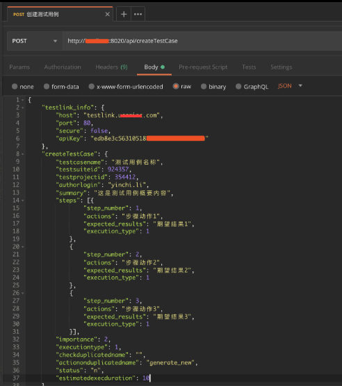
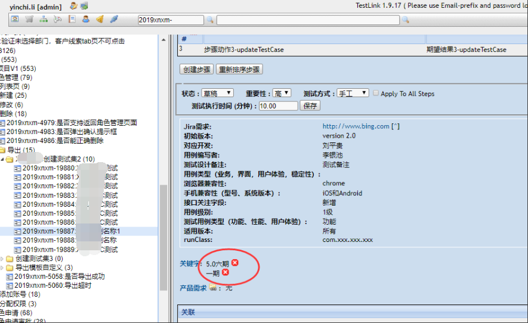
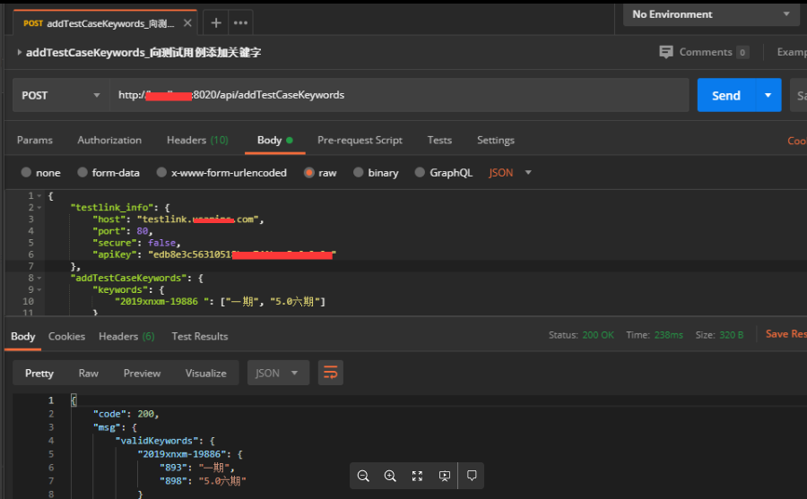
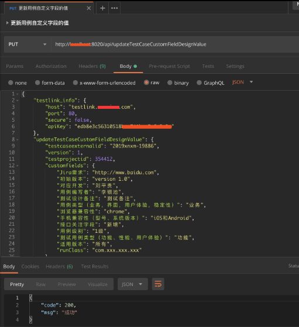
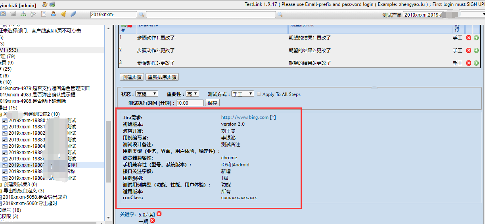

# Postman2Testlink

Requirements
  tool  | version
  ------------- | -------------
 nodejs  | >8.17.0
 testlink  | 1.9.17
 postman  | all

[API Document](https://note.youdao.com/ynoteshare1/index.html?id=1b64f29437a77f86f0e22ac412987c54&type=note)

[FAQ](https://note.youdao.com/ynoteshare1/index.html?id=1b64f29437a77f86f0e22ac412987c54&type=note)

## install
```
npm install
```

## Start the service


```
node test/server.js
```

## postman Script


There is an example postman script in the project directory that can be imported directly into postman.（工程目录下有postman脚本示例，可以直接导入postman）
---


```
postman_script_demo\Postman2Testlink.postman_collection.json
```


Each time the client requests, testlink_info needs to be configured.（客户端每次请求，需要配置testlink_info）
---

```JSON
{
 "testlink_info":
               {
                   "host":"testlink.xxxx.com",
                   "port":80,
                   "secure":false, 
                   "apiKey":"xxxxxxxx"
               }
}
```

 Configuration parameters
  key  | value
  ------------- | -------------
 host  | Hostname or IP where TestLink is hosted.
 port  | Hostname or IP where TestLink is hosted.Set if you are not using default port
 secure  |  Use or not secure connection. If set to true, use http and port 443 if a port was not defined else uses http and port 80
 apiKey  | The api key to interact with TestLink.

## createTestCase





## addTestCaseKeywords




## updateTestCaseCustomFieldDesignValue






# 更新记录

#### 2020-03-28
>add getProjectTestPlans() 新增获取测试项目中所有测试计划数据

#### 2020-03-31
>add getTestCaseKeywords() 获取给定测试用例的关键字列表

>add batchAddTestCaseKeywords() 批量对给定测试用例，添加关键字
